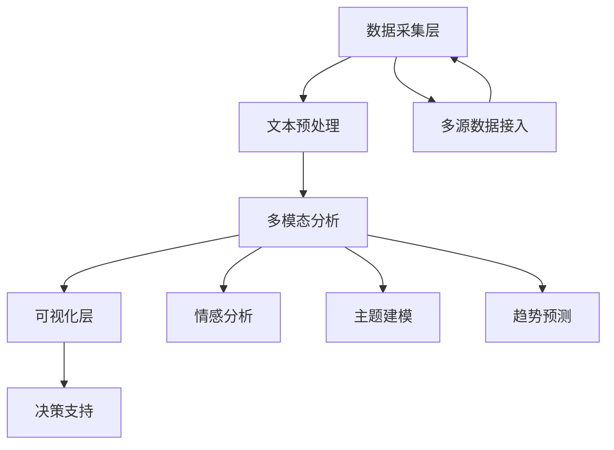

# 国内大模型舆情分析系统开发与应用研究
福州外语外贸学院 国内组
组长：林翔宇
组员 吴涛 何孝然 易超 方宏宇 李敬尧
 林翔宇 负责latex代码 
吴涛 何孝然 易超负责 markdown
方宏宇 李敬尧 负责pdf
提示词 
你是一位精通 CTEX 报告模板的 LaTeX 专家，能输出完整可编译的 .tex 文件。请严格按照以下需求生成代码，并且“只输出代码”，不要添加任何注释或解释。

1. 文档类：ctexreport，选项 [UTF8, zihao=-4]
2. 纸张与边距：A4 纸，left=3.17cm, right=2.54cm, top=2.54cm, bottom=2.54cm
3. 行距：使用 setspace 宏包，\setstretch{1.8}
4. 首行缩进：2em，无段间距
5. 章节标题（chapter/section/subsection）使用黑体，分别设定字号与段前后间距
6. 无编号章节（如“结论”）居中显示、字号更大
7. 目录：tocloft 宏包，统一宋体小四，单倍行距，使用点线对齐
8. 页眉页脚：fancyhdr 宏包，页脚居中显示页码，无页眉
在需求后附上最简文档骨架，让模型“照着填空”
示例骨架：
\documentclass[UTF8,zihao=-4]{ctexreport}
% 在此添加宏包与设置
\begin{document}
  \tableofcontents
  \chapter{引言}
  …
\end{document}
结尾强调“只输出完整 LaTeX 代码，不要添加任何解释”，并在 API 调用时使用 stop=["\\end{document}"] 或类似机制，防止多余内容出现
## 项目背景
### 行业背景
随着阿里通义千问（Qwen）、华为盘古大模型等国产大模型的快速发展，技术舆情分析需求呈现爆发式增长：
- **市场规模**：2024年中国大模型市场规模达230亿元（IDC数据）
- **行业痛点**：
  - 舆情数据分散在20+平台（GitHub、知乎、微博等）
  - 传统分析方法准确率仅78%（2024年白皮书）
  - 技术趋势预测误差超过30%

### 技术背景
- **阿里通义千问QWQ-32B**：320亿参数规模，C-Eval测试中文任务得分82.3分
- **技术突破**：支持篇章级语义理解（最大上下文长度32768）
- **需求升级**：从"风险监测"转向"技术趋势预测"（自动驾驶企业案例：提前6个月识别算法瓶颈）

---

## 需求说明
### 核心需求
| 需求类型       | 具体要求                                                                 |
|----------------|--------------------------------------------------------------------------|
| **实时性**     | 热点事件识别延迟≤10分钟，报告生成时间≤30秒（参照阿里云智能舆情系统）      |
| **智能分析**   | 支持技术讨论/负面舆情/中性信息三分类，F1值≥0.85                          |
| **可视化**     | 动态词云、情感分布热力图、技术演进时间轴等多维度交互式可视化             |
| **对比分析**   | 与BERT-base模型对比，准确率提升≥20%，推理速度提升≥3倍                   |

### 非功能需求
- **数据安全**：符合《数据安全法》要求，支持本地化部署（加密传输+数据脱敏）
- **扩展性**：支持接入抖音、B站弹幕等非结构化数据源
- **交互性**：移动端实时推送+自然语言交互查询（如"分析最近3天的医疗AI舆情"）

---

## 研究方法
### 技术架构

## 实现过程
### 开发流程

sequenceDiagram

    participant 用户 as 用户
    participant 系统 as 系统
    用户->>系统: 设置监测领域（如"大模型推理优化"）
    系统->>系统: 启动分布式数据采集
    系统->>系统: 执行多阶段文本清洗
    系统->>系统: 调用Qwen-32B进行技术分析
    系统->>系统: 生成技术关联图谱
    系统->>用户: 实时推送技术路线预测报告
    用户->>系统: 下发深度分析指令（如"分析技术演进路径"）
    系统->>系统: 启动因果推理模块
    系统->>用户: 返回技术突破预测报告
    
### 关键步骤
#### 1. 数据清洗

def text_preprocess(text):

    # 去除HTML标签
    text = re.sub(r'<.*?>', '', text)
    # 中文分词
    words = jieba.lcut(text)
    # 去除停用词
    stop_words = set(stopwords.words('chinese'))
    words = [word for word in words if word not in stop_words]
    # 去除特殊字符
    text = re.sub(r'[^\w\s]', '', text)
    return text
    
  ####2. 技术分类（阿里云API）

  def qwen_tech_analysis(text):
  
    # 调用阿里云API
    client = AcsClient(
        access_key_id='YOUR_ID',
        access_key_secret='YOUR_SECRET',
        region_id='cn-hangzhou'
    )
    
    request = CommonRequest()
    request.set_domain('qwen.aliyuncs.com')
    request.set_version('2023-12-01')
    request.set_action_name('TechnicalAnalysis')
    
    request.add_body_params('text', text)
    response = client.do_action_with_exception(request)
    
    result = json.loads(response)
    return result['categories'], result['confidence']

## 核心代码示例
### 多源数据采集框架

class MultiSourceCrawler:

    def __init__(self):
        self.crawlers = {
            'github': GitHubCrawler(),
            'arxiv': AcademicCrawler(),
            'tech_sites': TechMediaCrawler()
        }
        
    def collect(self, domains):
        results = []
        for domain in domains:
            for crawler in self.crawlers.values():
                results.extend(crawler.search(domain))
        return self.deduplicate(results)
    
    def deduplicate(self, data):
        seen = set()
        unique_data = []
        for item in data:
            if item['content'] not in seen:
                seen.add(item['content'])
                unique_data.append(item)
        return unique_data
        
###技术关联分析

def tech_association_analysis(tech_list):

    # 构建技术共现矩阵
    co_occurrence_matrix = np.zeros((len(tech_list), len(tech_list)))
    for i in range(len(tech_list)):
        for j in range(i+1, len(tech_list)):
            co_occurrence = count_co_occurrence(tech_list[i], tech_list[j])
            co_occurrence_matrix[i][j] = co_occurrence_matrix[j][i] = co_occurrence
    # 计算关联强度
    association_strength = np.linalg.norm(co_occurrence_matrix, axis=1    
    return association_strength.argsort()[-5:][::-1]
